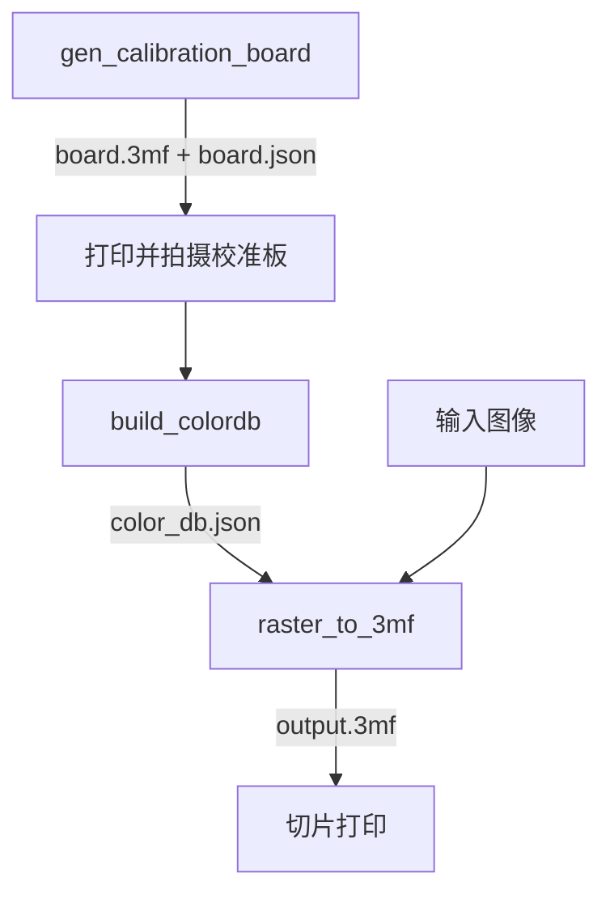
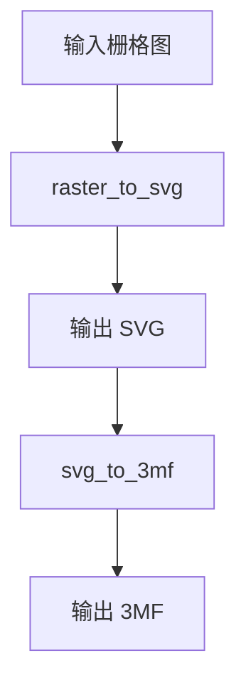

# ChromaPrint3D Apps 指南

## 构建与运行位置

- 构建步骤请看：`docs/build.md`
- 本地开发与联调请看：`docs/development.md`
- 构建完成后可执行文件位于：`build/bin/`

## 可执行工具清单

当前 `apps/CMakeLists.txt` 定义了 8 个 CLI：

| 可执行文件 | 用途 |
|---|---|
| `gen_calibration_board` | 生成校准板 3MF 与元数据 |
| `build_colordb` | 从校准板照片构建 ColorDB |
| `raster_to_3mf` | 栅格图像转多色 3MF |
| `svg_to_3mf` | SVG 转多色 3MF |
| `raster_to_svg` | 栅格图像向量化为 SVG |
| `gen_representative_board` | 从配方集生成代表性校准板 |
| `gen_stage` | 生成阶梯校准模型 |
| `gen_test_preset_3mf` | 生成预设映射测试 3MF（调试工具） |

## 典型使用流程

### 流程 A：校准并转换栅格图



### 流程 B：矢量链路



## 各工具快速参考

下列命令均假设在仓库根目录执行，并使用 `build/bin/` 前缀。

### 1) `gen_calibration_board`

用途：生成校准板模型与元数据。  
示例：

```bash
./build/bin/gen_calibration_board --channels 4 --out board.3mf --meta board.json
```

### 2) `build_colordb`

用途：根据校准板照片 + 元数据生成 ColorDB。  
示例：

```bash
./build/bin/build_colordb --image calib_photo.png --meta board.json --out color_db.json
```

### 3) `raster_to_3mf`

用途：栅格图像转换为多色 3MF。  
示例：

```bash
./build/bin/raster_to_3mf --image input.png --db color_db.json --out output.3mf
```

### 4) `svg_to_3mf`

用途：SVG 直接转换为多色 3MF。  
示例：

```bash
./build/bin/svg_to_3mf --svg input.svg --db color_db.json --out output.3mf
```

### 5) `raster_to_svg`

用途：栅格图像做共享边界向量化并输出 SVG。  
示例：

```bash
./build/bin/raster_to_svg --image input.png --out output.svg --colors 16
```

### 6) `gen_representative_board`

用途：从配方集生成代表性校准板。  
示例：

```bash
./build/bin/gen_representative_board --recipes recipes.json --ref-db color_db.json --out board.3mf
```

### 7) `gen_stage`

用途：生成固定阶梯校准模型。  
示例：

```bash
./build/bin/gen_stage --out stage.3mf
```

### 8) `gen_test_preset_3mf`

用途：生成切片预设/AMS 映射测试用 3MF（开发调试用途）。  
示例（位置参数）：

```bash
./build/bin/gen_test_preset_3mf test_8color_preset.3mf data/presets
```

## 参数与行为说明

- `apps` 下工具的完整参数以各工具 `--help` 输出为准。
- `gen_test_preset_3mf` 当前使用位置参数，不提供 `--help` 选项。
